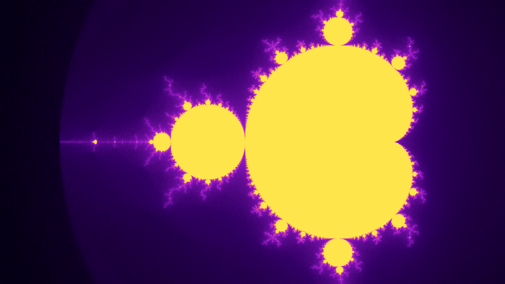
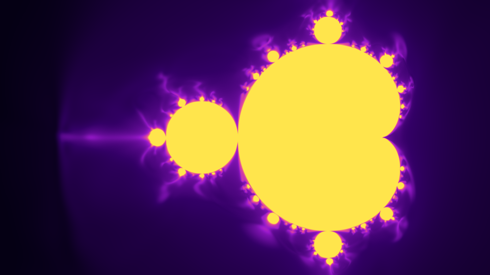

# Learning the Mandelbrot Set with Neural Networks

<p align="center">
  
</p>

**Implicit neural representation of the Mandelbrot set** using deep MLPs trained on a smooth escape-time signal.  
This project explores why **Fourier features + residual MLPs + boundary-biased sampling** are critical for learning high-frequency fractal structure.

This repo is both:
- a **visual experiment** (high-resolution renders, GIFs, videos), and
- a **clean, reproducible research/engineering project**.

---

## 🔍 What this project shows

- How to cast the Mandelbrot set as a **continuous regression problem**
- Why **plain MLPs struggle** with fractal boundaries
- How **Fourier features** dramatically improve high-frequency detail
- How **sampling strategy matters more than loss reweighting**
- How to render **4K outputs safely** using tiled inference

---

## ✨ Results

### Fourier features vs. no Fourier features

<table align="center">
  <tr>
    <th>With Fourier Features</th>
    <th>Without Fourier Features</th>
  </tr>
  <tr>
    <td align="center">
      
    </td>
    <td align="center">
      
    </td>
  </tr>
</table>

---

## 🧠 Method overview

### Target function
Instead of binary membership, the model learns a **smooth, normalized escape-time value**:

- Continuous signal
- Log-scaled for better gradient behavior
- Outputs in `[0, 1]`

### Dataset
- Uniform sampling over the complex plane
- **Boundary-biased sampling**:
  - Oversample points
  - Keep only those whose escape values fall in a target band
  - Forces model capacity near the fractal boundary

### Model
- Input: `(x, y)` complex coordinates
- Optional **multi-scale Gaussian Fourier features**
- Deep **residual MLP** with LayerNorm
- No sigmoid during training (pure regression)

### Training
- SmoothL1 loss
- AdamW optimizer
- Cosine LR schedule
- Gradient clipping
- Mixed precision (AMP) on CUDA

### Rendering
- OOM-safe **tiled inference**
- Quantile-based contrast normalization
- Gamma correction + glow post-processing
- Full-HD previews and 4K final renders

---

## 📁 Repository structure

```
.
├── src/
│   └── mandelbrot_nn/            # Core package
│       ├── mandelbrot.py         # Escape-time logic
│       ├── data.py               # Dataset & sampling
│       ├── models.py             # MLPs & Fourier features
│       ├── train.py              # Training loop
│       ├── render.py             # Tiled rendering
│       ├── palettes.py           # Colormaps & glow
│       ├── utils.py
│       └── scripts/
│           ├── train.py          # Main training entrypoint
│           └── make_media.py     # GIF / MP4 generation
├── experiments/
│   └── configs/                  # JSON configs
├── assets/                       # Curated visuals (tracked)
├── runs/                         # Training outputs (gitignored)
└── notebooks/                    # Exploratory notebooks
```

---

## 🚀 Quickstart

**1. Install**
```
pip install -e .
```

**2. Train a model**
```
python scripts/train.py
```

or with a custom config:

```
python scripts/train.py --config experiments/configs/default.json
```

Each run creates:

```
runs/<timestamp>/
├── config.json
├── metrics.csv
├── ckpt/
└── images/
```

---

### 🎞️ Create GIFs or videos
Generate animations from saved frames:

```
python src/scripts/make_media.py \
  --input images/images_fourier_short \
  --gif outputs/fourier_final.gif \
  --duration-ms 200
```

Or an MP4 video:

```
python src/scripts/make_media.py \
  --input images/images_fourier_short \
  --mp4 outputs/fourier_final_fullhd.mp4 \
  --fps 5 --size 1920 1080
```

---

## 🧪 Experiments & ablations

The codebase supports:
- Vanilla MLP vs Fourier MLP
- Single-scale vs multi-scale Fourier features
- Uniform vs boundary-biased sampling
- Different resolutions and render pipelines

See `experiments/configs/` for reproducible setups.
